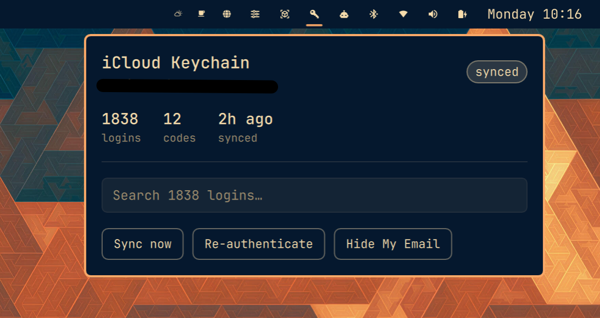

# omarchy-keychain

An [Omarchy](https://omarchy.org/) bar widget for your iCloud Keychain passwords.

A key icon sits in the bar and tells you whether your vault is fresh. Click it to
search 1800-odd logins, copy a username, password or verification code, and
re-authenticate when Apple asks. Passwords are never shown on screen.




## This is the front end, not the engine

The widget displays a vault that
[iCloud-Keychain-for-Omarchy](https://github.com/EttienneM/iCloud-Keychain-for-Omarchy)
creates and keeps in sync. That project is what signs in to Apple, joins your
iCloud Keychain, and decrypts your passwords into an encrypted local store. This
repo is only the Omarchy-native interface on top of it.

**Install and sign in with `icp` first.** Its
[OMARCHY.md](https://github.com/EttienneM/iCloud-Keychain-for-Omarchy/blob/main/OMARCHY.md)
walks through it, and includes an important warning: joining the keychain
requires a device passcode, and roughly 10 wrong entries destroys your keychain
escrow record permanently. Read that before you start.

You need the fork specifically, not the upstream project — the widget relies on
`icp status`, `icp codes`, `icp list` and `icp copy`, which only exist there.

## Install

```bash
git clone https://github.com/EttienneM/omarchy-keychain.git
cd omarchy-keychain
./install.sh
```

The installer looks for your `icp` checkout in a few conventional places. If
yours lives elsewhere, point at it once and the location is remembered:

```bash
./install.sh --icp-home ~/path/to/iCloud-Keychain-for-Omarchy
```

A key icon appears in the bar. If it doesn't, check `omarchy-shell shell listPlugins`
for `icloud.keychain`, and `journalctl --user -e` for QML errors.

## Using it

| Action | Result |
| --- | --- |
| Click the key icon | Open the panel |
| Right-click the key icon | Sync now, without opening anything |
| Type | Search titles, usernames and domains |
| Click a result | Expand it |
| Username / Password / Code | Copy that one field; the button ticks to confirm |
| `Esc` | Close |

Verification codes appear inline on a search result that has one, with a live
countdown derived from that credential's own period and rollover second. Nothing
is listed until you search — the panel stays quiet otherwise.

Bind it to a key in `~/.config/hypr/bindings.lua`:

```
omarchy-shell icloud.keychain toggle
```

Or copy a field straight from a script:

```bash
omarchy-shell icloud.keychain copy github.com you@example.com password
```

## What gets installed

```
~/.config/omarchy/plugins/icloud.keychain/   the Quickshell widget
~/.local/bin/omarchy-keychain-*              helper scripts
~/.config/systemd/user/                      sync timer + anisette unit
~/.config/omarchy/shell.json                 widget added to the bar
~/.config/omarchy-keychain.conf              where your icp checkout lives
```

`./uninstall.sh` reverses all of it. Your vault, your `icp` install and your
Apple account are untouched.

## Settings

Through the Omarchy settings panel, or `shell.json`:

- **Status refresh (seconds)** — how often the bar polls vault state. Default 60.
- **Only show the icon when attention is needed** — hides the widget while
  everything is healthy. Default off.

## The sync timer

The installer enables a user timer that syncs every four hours. That is not only
about freshness. The browser extension triggers its own sync whenever it finds
the vault more than six hours old — so if a token has quietly expired, that
sync fails and retries every few minutes, and each attempt asks Apple to
authenticate, which lights up your phone with sign-in prompts. Syncing on a
schedule keeps the vault under that threshold so the extension's fallback never
fires.

If prompts ever do start arriving, the widget will say **needs you**: click
**Re-authenticate**.

## How your secrets are handled

- **Passwords are never displayed.** There is no reveal. The panel lists titles
  and usernames; a password only ever moves to the clipboard.
- **Secrets never pass through the shell process.** Copying runs
  `icp copy | wl-copy` as a detached subprocess whose output the widget does not
  read. Usernames are the exception — they are already on screen and are copied
  directly.
- **Authentication happens in a real terminal.** *Re-authenticate* opens a
  floating terminal running `icp login`. Taking an Apple ID password in a QML
  text field would be a worse security posture for a cosmetic gain.
- **A failed copy notifies you.** Success is silent — the button ticks. A silent
  failure would be indistinguishable from success, leaving whatever was on the
  clipboard before.

The tick marks the click, not the exit status: the copy is detached so
`wl-copy`'s clipboard server can outlive it, and a detached process has no exit
code to wait on. The failure notification covers that gap.

## Requirements

Omarchy with the Quickshell-based shell, `wl-clipboard`, `python3`, and a working
`icp` checkout. `xdg-terminal-exec` is used to open the auth terminal.

## Credits

The engine is [Sank6/iCloud-Keychain-for-Linux](https://github.com/Sank6/iCloud-Keychain-for-Linux)
via [this fork](https://github.com/EttienneM/iCloud-Keychain-for-Omarchy), which
builds on JJTech's GrandSlam work, OpenBubbles/rustpush, Apple's open-source
Security code, and the SideStore ecosystem's anisette server.

Unofficial and not affiliated with Apple. MIT licensed.
